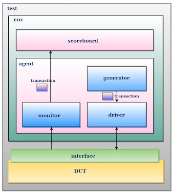

# SystemVerilog Mini Projects

Welcome to the **SystemVerilog Mini Projects** repository! This repo contains my Verilog and SystemVerilog implementations of fundamental digital design modules, each with comprehensive testbenches and verification components.

> **Note:** This repository is for my learning purposes and to practice skills relevant for Design and Verification roles.

## Projects Included

- **D Flip-Flop**
- **Synchronous FIFO**

## Project Structure

Each project in this repository includes:

- Verilog RTL code for the main design
- A full-fledged SystemVerilog testbench environment

This structure enables robust functional verification and modular, reusable code.

## Testbench Architecture

The testbenches are written in SystemVerilog and follow a modern verification methodology:

- **Generator:** Randomizes and sends input transactions.
- **Driver:** Applies transactions to the DUT (Design Under Test).
- **Monitor:** Observes DUT outputs and collects results.
- **Scoreboard:** Compares expected vs. actual outputs for functional correctness.
- **Interface:** Connects the testbench and DUT signals.
- **Transaction Class:** Encapsulates input/output data for easy manipulation and checking.

**More projects will be added to this repository in the future. Stay tuned!**
